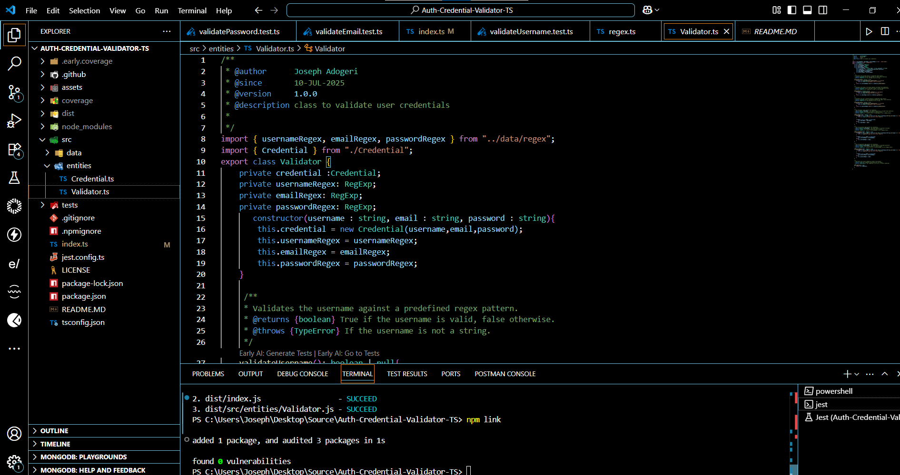
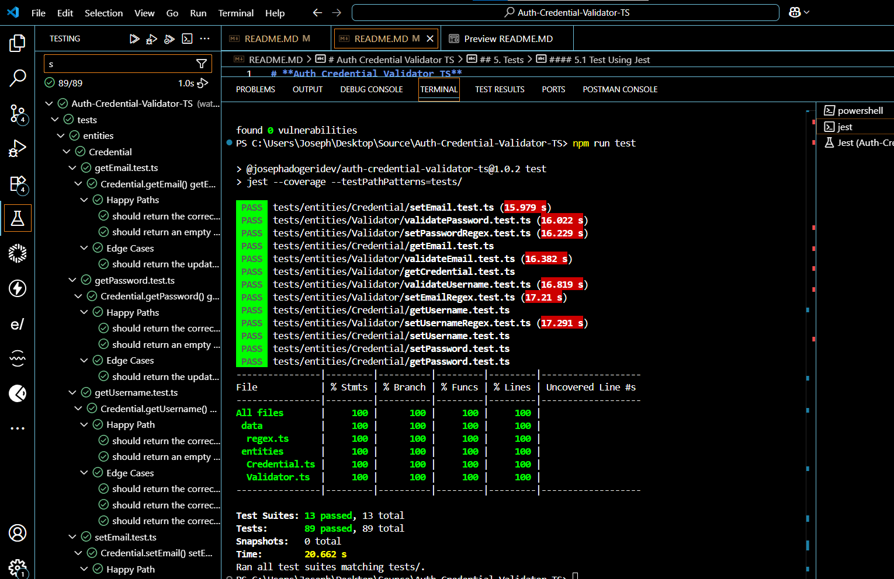
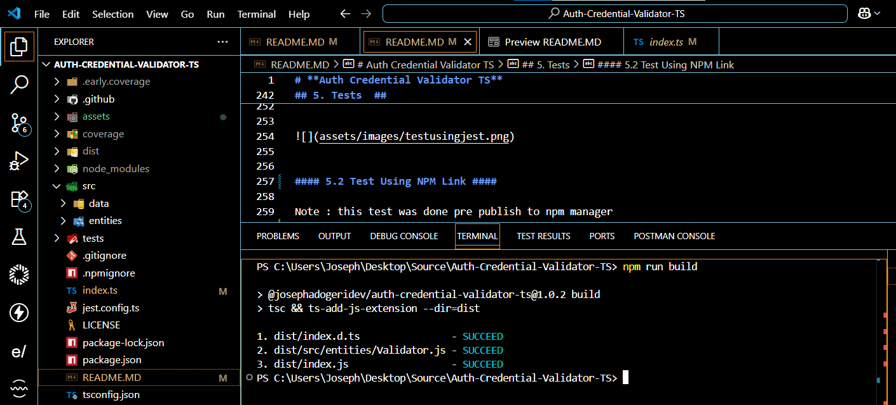
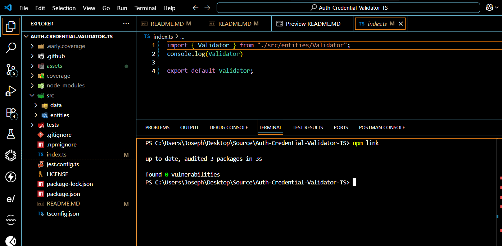
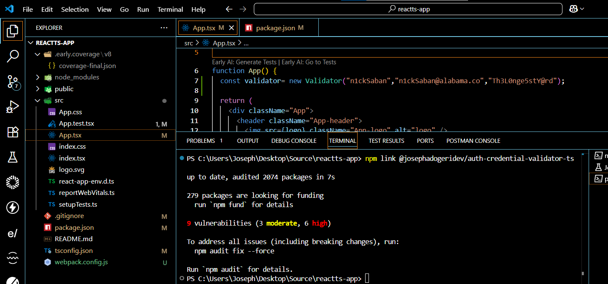
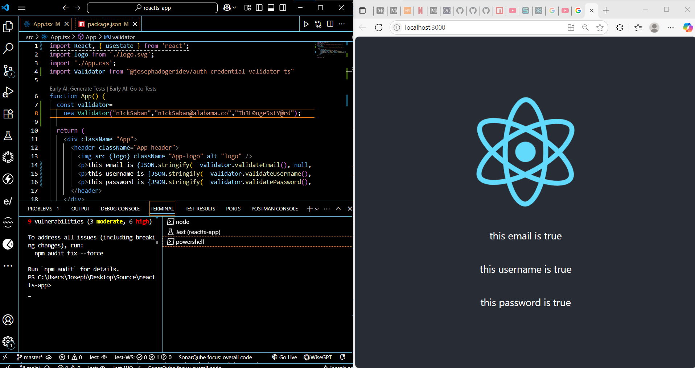
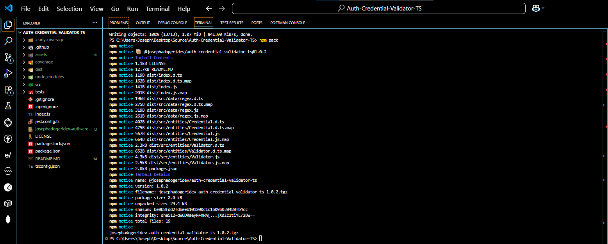
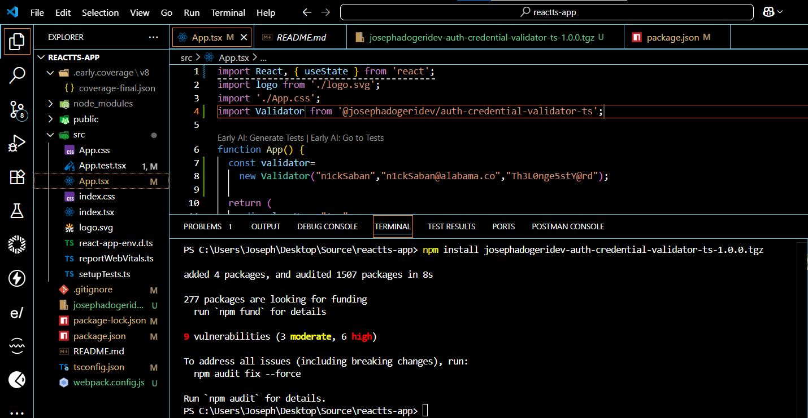

# **Auth Credential Validator TS**

**Version:** 1.0.2
**Date:** July 10, 2025

---

## Description

This is a typescript npm package for both frontend and backend Applications (Express + Node + React + React Native) which validate credentials (username, email and password) using dynamic regex field.

## Authors

[@jadogeri](https://www.github.com/jadogeri)

## Repository

 [https://github.com/jadogeri/Auth-Credential-Validator-TS.git](https://github.com/jadogeri/Auth-Credential-Validator-TS.git)

 ## Registory

[https://www.npmjs.com/package/@josephadogeridev/auth-credential-validator-ts](https://www.npmjs.com/package/@josephadogeridev/auth-credential-validator-ts)


## Screenshots

|  |  |
| -------------------------------------------- | -------------------------------------------- |
|                                              |                                              |

## Table of Contents

<ul>
      <li><a href="#1-introduction">1. Introduction</a>
        <ul>
          <li><a href="#11-purpose">1.1 Purpose</a> </li>
          <li><a href="#12-scope">1.2 Scope</a> </li>
          <li><a href="#13-intended-audience">1.3 Intended Audience</a> </li>
        </ul>
      </li>
    </ul>
    <ul>
      <li><a href="#2-technology-stack">2. Technology Stack</a>
      </li>
    </ul>
    <ul>
      <li><a href="#3-data-design">3. Data Design</a>
        <ul>
          <li><a href="#31-data-entities-and-relationships">3.1 Entities and Relationships</a> </li>
        </ul>
      </li>
    </ul> 
    <ul>
        <li><a href="#4-usage">4. Usage</a> </li>
        <ul>
            <li><a href="#41-install-dependency">4.1 Install Dependency</a> </li>
            <li><a href="#42-classes-and-methods">4.2 Classes and Methods</a> </li>
            <ul>
                <li><a href="#421-credential-class">4.2.1 Credential Class</a> </li>
                <li><a href="#422-validator-class">4.2.2 Validator Class</a> </li>
            </ul>
            <li><a href="#43-code-snippet">4.3 Code Snippet</a> </li>
        </ul>
    </ul> 
    <ul>
        <li><a href="#5-tests">5. Tests</a> </li>
        <ul>
            <li><a href="#51-test-using-jest">5.1 Test Using Jest</a> </li>
            <li><a href="#52-test-using-npm-link">5.2 Test Using NPM Link</a> </li>
            <li><a href="#53-test-using-npm-pack">5.3 Test Using NPM Pack</a> </li>
        </ul>
    </ul> 
    <ul>  
        <li><a href="#6-license">6. License</a>
        </li>
    </ul> 
    <ul> 
        <li><a href="#7-references">7. References</a>
        </li>
    <ul>

## **1. Introduction**

### **1.1 Purpose**

This document outlines the package architecture, components, and design considerations for Auth Credential Validator TS package. The goal is to provide support in validating user credentials, ensuring credentials adhere to standards for most online accounts.

### **1.2 Scope**

This package will allow users to:

- Accept valid credentials (username, email and password).
- Resolve undefined and null values as inputs.
- Provide ability to alter regular expression used to validate credentials.
- Render results of credentials after test.

### **1.3 Intended Audience**

- Junior or Senior developers.
- beginners learning typescript.

---

### **2. Technology Stack**

- **Programming Languages**: Typescript
- **IDE**: Visual Studio Code (VSCode)
- **Test**: Jest
- **Plugins**: Early AI
- **Registory**: NPM (Node Package Manager)
- **Source Control**: Git and GitHub
- **CI/CD**: GitHub Actions
- **Code Analysis**: SonarQube

## **3. Data Design**

### **3.1 Data Entities and Relationships**

| Entity | Description                                          |
| ------ | ---------------------------------------------------- |
| CREDENTIAL   | User account information. |
| VALIDATOR  | Validates auth information of Users.           |

---

## **4. Usage**

### 4.1 install dependency ###

1 Type npm install @josephadogeridev/auth-credential-validator-ts to install dependencies.

```bash
  npm install @josephadogeridev/auth-credential-validator-ts
```
### 4.2 Classes and Methods ###

This project includes the following core components:

#### 4.2.1 `Credential` Class ####

The `Credential` class represents a single credential with its attributes and methods.

*   **Attributes:**
    *   `username` (string): The username of the credential.
    *   `email` (string): The email of the credential.
    *   `password` (string): The password of the credential.
*   **Methods:**
    *   `constructor(username ,email ,password)`: The constructor method to initialize a new `Credential` object.
        *   **Parameters:**
            *   `username` (string): The username of the credential.
            *   `email` (string): The email of the credential.
            *   `password` (string): The password of the credential.
        *   **Description:** Creates a new `Credential` instance with the provided username, email, and password.
    *   `getUsername()`: Returns a string containing the credential's username.
        *   **Description:** Retrieves the username as a readable string.
    *   `getEmail()`: Returns a string containing the credential's email.
        *   **Description:** Retrieves the email as a readable string.
    *   `getPassword()`: Returns a string containing the credential's password.
        *   **Description:** Retrieves the password as a readable string.
    *   `setUsername(username)`: Updates the username attribute.
        *   **Parameters:**
            *   `username` (`string` ): The new username of a credential.
        *   **Description:** updates the username of the credential object.
    *   `setEmail(email)`: Updates the email attribute.
        *   **Parameters:**
            *   `email` (`string` ): The new email of a credential.
        *   **Description:** updates the email of the credential object.
    *   `setPassword(password)`: Updates the password attribute.
        *   **Parameters:**
            *   `password` (`string` ): The new password of a credential.
        *   **Description:** updates the password of the credential object.

#### 4.2.2 `Validator` Class ####

The `Validator` class represents a single validator with its attributes and methods.

*   **Attributes:**
    *   `credential` (RegExp object): The credential object of the validator.
    *   `usernameRegex` (string): The username regex of the validator.
    *   `emailRegex` (string): The email regex of the validator.
    *   `passwordRegex` (string): The password regex of the validator.
*   **Methods:**
    *   `constructor(username, email, password)`: The constructor method to initialize a new `Validator` object.
        *   **Parameters:**
            *   `username` (string): The initial username of the credential object.
            *   `email` (string): The initial email of the credential object.
            *   `password` (string): The initial password of the credential object.
        *   **Description:** Creates a new `Validator` instance with optional username, email, and password.
    *   `validateUsername()`: Returns a boolean containing the Validator's username test result.
        *   **Description:** Tests if `Credential`'s username is valid then retrieves the result.
    *   `validateEmail()`: Returns a boolean containing the Validator' email test result.
        *   **Description:** Tests if `Credential`'s email is valid then retrieves the result.
    *   `validatePassword()`: Returns a boolean containing the Validator' password test result.
        *   **Description:** Tests if `Credential`'s password is valid then retrieves the result .
    *   `setUsernameRegex(regex)`: Updates the usernameRegex attribute.
        *   **Parameters:**
            *   `regex` (`RegExp` ): The new usernameRegex of a validator.
        *   **Description:** updates the usernameRegex attribute of the validator object.
    *   `setEmailRegex(regex)`: Updates the emailRegex attribute.
        *   **Parameters:**
            *   `regex` (`RegExp` ): The new emailRegex of a validator.
        *   **Description:** updates the emailRegex attribute of the validator object.
    *   `setPasswordRegex(password)`: Updates the passwordRegex attribute.
        *   **Parameters:**
            *   `regex` (`RegExp` ): The new passwordRegex of a validator.
        *   **Description:** updates the passwordRegex attribute of the validator object.
    *   `getCredential()`: Returns a credential object.
        *   **Description:** Retrieves the credential attribute of a validator .

### 4.3 code snippet ###

```typescript

import Validator from "@josephadogeridev/auth-credential-validator-ts"
const validator = new Validator("jose mourinho","jose mpurinho@gmailcom","rtw5wwvw+-*/twrt");

console.log("*********** Testing Package before publish using npm link***********\n\n");
console.log("validator Object : ",validator);
console.log("validator Credentials : ",validator.getCredential());
console.log("validate email :" ,validator.validateEmail());
console.log("validate username :" ,validator.validateUsername());
console.log("validate password :" ,validator.validatePassword());

validator.credential.setEmail("joseMourinho@gmail.com");
validator.credential.setUsername("Josemourinho");
validator.credential.setPassword("Mourinho!trebl3");

console.log("\n\n*********** test new credentials***********\n\n");

console.log("validate email :" ,validator.validateEmail());
console.log("validate username :" ,validator.validateUsername());
console.log("validate password :" ,validator.validatePassword());

console.log("\n\n*********** update regex ***********\n\n");
validator.setEmailRegex(/^(([^<>()[\]\\.,;:\s@"]+(\.[^<>()[\]\\.,;:\s@"]+)*)|.(".+"))@((\[[0-9]{1,3}\.[0-9]{1,3}\.[0-9]{1,3}\.[0-9]{1,3}\])|(([a-zA-Z\-0-9]+\.)+[a-zA-Z]{2,}))$/)
validator.setUsernameRegex(/^(?=.*[A-Za-z0-9]).{3,30}$/);
validator.setPasswordRegex(/^(?=.*[a-z])(?=.*[A-Z])(?=.*\d)(?=.*[!@#\$%\^&\*])[\w!@#\$%\^&\*]{8,30}$/);


```

## 5. Tests  ##

Note : this test was done pre publish to NPM repository.

#### 5.1 Test Using Jest ####

1 Inside of root directory, type npm run test to run unit tests.

```bash
  npm run test
```




#### 5.2 Test Using NPM Link ####

1 Run command npm run build to package app and generate  dist directory.

```bash
  npm run build
```


2 In the root of package run npm link to create symbolic link  between a local package under development and another Node.js project that wants to use it as a dependency. 

```bash
  npm link
```




2 Create a new react project or use an existing project (typescript).

3 In the root or react project, run command npm link @josephadogeridev/Auth-Credential-Validator-TS to install node with created package.


```bash
npm link @josephadogeridev/auth-credential-validator-ts
```



#### Example of Test Using NPM Link ####



#### 5.3 Test Using NPM Pack ####

1 In the root of package run npm run build to generate build (./dist).

```bash
  npm run build
```


2 In the root of package run npm pack to package the module into a zipped file (.tgz).

```bash
  npm pack
```



3 Create or use existing React Application (typescript).

4 Copy and paste the created file in the root of a React Application.

5 Run command npm install josephadogeridev-auth-credential-validator-ts-1.0.0.tgz to install created package.

```bash
  npm install josephadogeridev-auth-credential-validator-ts-1.0.0.tgz
```



## **6. License**

[LICENSE](/LICENSE)

---

## **7. References**

* FreeCodeCamp : [Frontend Web Development: (HTML, CSS, JavaScript, TypeScript, React)](https://www.youtube.com/watch?v=MsnQ5uepIa).
* AweSome Open Source : [Awesome Readme Templates](https://awesomeopensource.com/project/elangosundar/awesome-README-templates)
* Readme.so : [The easiest way to create a README](https://readme.so/)
* Mockingoose : [How to test mongoose models with jest and mockingoose](https://dev.to/darkmavis1980/how-to-test-mongoose-models-with-jest-and-mockingoose-2k10)
* NPM : [Creating nodejs modules](https://docs.npmjs.com/creating-node-js-modules)
* Dev.io : [Testing npm packages before publishing](https://dev.to/vcarl/testing-npm-packages-before-publishing-h7o)
* FreeCodeCamp : [How to create and publish an NPM Package - step by step guide](https://www.freecodecamp.org/news/how-to-create-and-publish-your-first-npm-package/)
* Dev.io : [Create and Publish NPM Package for custom Hooks in React JS](https://dev.to/shivampawar/create-and-publish-npm-package-for-custom-hooks-in-react-js-5237)

